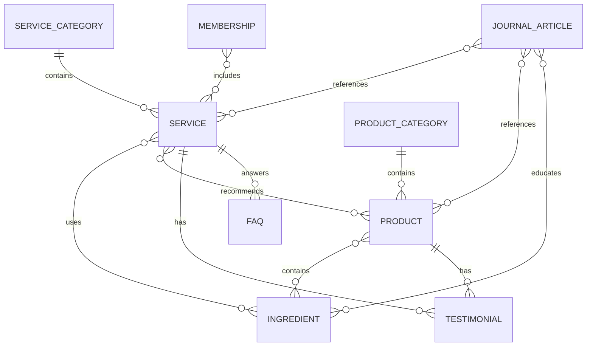

# Premium Spa & Wellness Website Plan

## Scope

Build a premium spa and wellness marketing and commerce-style website with a small static-content architecture.

Included now:

- Next.js 15 app architecture
- Tailwind CSS visual system
- shadcn/ui component foundation
- Static TypeScript content data
- Service, product, journal, about, and contact routes
- AI wellness assistant using AI SDK with OpenRouter
- Entity relationship visualization using React Flow
- SEO and structured data planning

Deferred:

- Authentication
- Database
- Payments
- Real booking backend
- CMS integration
- Customer accounts
- Membership billing
- Product subscriptions
- Loyalty rewards
- Mobile app integration

## Brand Direction

The website should feel like walking through a luxury spa hidden within a forest.

Design qualities:

- Calm
- Organic
- Sophisticated
- Cinematic
- Botanical
- Trustworthy
- Luxurious
- Minimal but immersive

Visual references:

- Luxury botanical skincare brands
- High-end wellness retreats
- Nature-inspired product experiences
- Editorial beauty storytelling
- Forest, moss, stone, wood, water, leaves, flowers

Core palette:

- Deep forest green
- Green-black charcoal
- Moss green
- Warm stone
- Soft ivory
- Muted clay
- Botanical gold accent

Typography direction:

- Editorial serif headlines
- Refined sans-serif body text
- Large cinematic section titles
- Minimal uppercase labels
- Generous spacing and line height

Motion direction:

- Subtle scroll reveals
- Calm fade-ins
- Slow parallax imagery
- Floating botanical elements
- Soft product hover states
- Gentle section transitions

Avoid excessive or playful animation. The motion should feel quiet, premium, and restorative.

## Recommended Stack

- Next.js 15
- React
- TypeScript
- Tailwind CSS
- shadcn/ui
- Framer Motion
- Lenis Smooth Scroll
- React Flow
- AI SDK
- OpenRouter
- Next.js Image
- Vercel deployment

Optional later:

- GSAP for advanced cinematic animation only if Framer Motion is not enough
- Sanity, Contentful, or Strapi once content management is needed

## App Architecture

```txt
app/
  page.tsx
  about/page.tsx
  services/page.tsx
  services/[slug]/page.tsx
  shop/page.tsx
  shop/[slug]/page.tsx
  journal/page.tsx
  journal/[slug]/page.tsx
  contact/page.tsx
  api/
    wellness-assistant/route.ts

components/
  layout/
  sections/
  cards/
  ui/
  motion/
  data-visualization/
  ai/

data/
  services.ts
  products.ts
  ingredients.ts
  testimonials.ts
  journal.ts
  memberships.ts
  faqs.ts

lib/
  ai.ts
  seo.ts
  schema.ts
  utils.ts

types/
  wellness.ts
```

## Routes

Primary routes:

- `/` - Home
- `/about` - Brand story, mission, philosophy, sustainability
- `/services` - Service category overview
- `/services/[slug]` - Individual treatment pages
- `/shop` - Product catalog
- `/shop/[slug]` - Product detail pages
- `/journal` - Wellness content index
- `/journal/[slug]` - Article detail pages
- `/contact` - Inquiry and consultation request

Useful later:

- `/ingredients` - Botanical ingredient library
- `/memberships` - Wellness membership programs
- `/experience` - Immersive retreat and spa storytelling page

## Page Plans

### Home

- Cinematic hero with nature background, product imagery, wellness message, and primary CTA
- Featured treatments
- Best-selling products
- Wellness philosophy
- Ingredient highlights
- Testimonials
- Before and after results
- Spa experience showcase
- Membership programs preview
- Newsletter CTA
- Footer

### About

- Brand story
- Mission
- Wellness philosophy
- Team introduction
- Certifications
- Sustainability practices

### Services Index

- Massage therapy
- Facial treatments
- Body treatments
- Aromatherapy
- Wellness programs
- Holistic healing
- Featured service cards
- Booking CTA
- FAQ preview

### Service Detail

- Overview
- Benefits
- Duration
- Pricing
- Techniques or ingredients used
- FAQs
- Related products
- Booking CTA

### Shop Index

- Product grid
- Product categories
- Best sellers
- Benefit-led product cards
- Ingredient highlights

### Product Detail

- Product story
- Benefits
- Ingredient breakdown
- Usage ritual
- Reviews
- Related services
- Related products

### Journal

- Beauty tips
- Wellness guides
- Self-care rituals
- Ingredient education
- Lifestyle articles

### Contact

- Inquiry form
- Consultation booking CTA
- Location map placeholder
- Business hours
- Social links

## Core Components

Layout:

- `SiteHeader`
- `TransparentNavbar`
- `MobileMenu`
- `StickyNavState`
- `Footer`
- `SmoothScrollProvider`
- `PageTransition`

Storytelling:

- `CinematicHero`
- `EditorialIntro`
- `SplitImageText`
- `LayeredImagePanel`
- `BotanicalTextureOverlay`
- `SectionKicker`

Services:

- `ServiceCard`
- `ServiceCategoryGrid`
- `ServiceDetailHeader`
- `TreatmentBenefits`
- `DurationPricingPanel`
- `BookingCTA`
- `ServiceFAQ`

Products:

- `ProductCard`
- `ProductGrid`
- `ProductDetailHero`
- `IngredientBreakdown`
- `ProductBenefits`
- `RelatedProducts`

Trust and conversion:

- `TestimonialsCarousel`
- `ReviewCard`
- `BeforeAfterGallery`
- `MembershipCard`
- `NewsletterCTA`
- `ConsultationForm`

AI:

- `WellnessAssistant`
- `RecommendationPromptCard`
- `AIResponsePanel`

Data visualization:

- `WellnessEntityGraph`
- `EntityNode`
- `EntityRelationshipLegend`

## Data Model

Use static TypeScript data first. This keeps the initial build simple while preserving a clean path to a CMS later.

```ts
type ServiceCategory = {
  id: string
  name: string
  slug: string
  description: string
}

type Service = {
  id: string
  categoryId: string
  name: string
  slug: string
  description: string
  benefits: string[]
  durationMinutes: number
  priceFrom: number
  ingredientIds: string[]
  faqIds: string[]
  relatedProductIds: string[]
}

type ProductCategory = {
  id: string
  name: string
  slug: string
}

type Product = {
  id: string
  categoryId: string
  name: string
  slug: string
  description: string
  benefits: string[]
  price: number
  image: string
  ingredientIds: string[]
  relatedServiceIds: string[]
  reviewIds: string[]
}

type Ingredient = {
  id: string
  name: string
  slug: string
  origin: string
  benefits: string[]
  scientificSupport?: string
  usage: string
}

type Testimonial = {
  id: string
  customerName: string
  quote: string
  rating: number
  serviceId?: string
  productId?: string
  image?: string
}

type JournalArticle = {
  id: string
  title: string
  slug: string
  excerpt: string
  category: string
  ingredientIds?: string[]
  serviceIds?: string[]
  productIds?: string[]
}

type Membership = {
  id: string
  name: string
  slug: string
  description: string
  benefits: string[]
  priceLabel: string
}

type FAQ = {
  id: string
  question: string
  answer: string
}
```

## Entity Relationships

Use React Flow to visualize how the content model connects.

Nodes:

- Service Category
- Service
- Product Category
- Product
- Ingredient
- Testimonial
- Journal Article
- Membership
- FAQ

Relationships:

- Service Category -> Service
- Product Category -> Product
- Service -> Ingredient
- Product -> Ingredient
- Service -> Product
- Product -> Testimonial
- Service -> Testimonial
- Journal Article -> Service
- Journal Article -> Product
- Journal Article -> Ingredient
- Membership -> Service
- Service -> FAQ



React Flow layout recommendation:

- Left: service categories and product categories
- Center: services and products
- Right: ingredients, testimonials, journal articles, FAQs
- Bottom: memberships

The graph should use custom node styles that match the forest-green luxury palette.

## Data Flow

Static content flow:

```txt
data/*.ts
  -> route pages
  -> section components
  -> card and detail components
  -> SEO/schema helpers
```

AI flow:

```txt
User prompt
  -> WellnessAssistant component
  -> app/api/wellness-assistant/route.ts
  -> AI SDK
  -> OpenRouter model
  -> streamed or returned response
  -> AIResponsePanel
```

## AI Wellness Assistant

Initial use cases:

- Help visitors choose between massage, facial, aromatherapy, and holistic treatments
- Recommend calming self-care rituals
- Suggest products by skin concern or wellness goal
- Explain botanical ingredients in brand voice
- Guide visitors toward consultation requests

Guardrails:

- No medical diagnosis
- No disease cure claims
- Encourage professional consultation for health concerns
- Keep recommendations grounded in available services and products
- Maintain a calm, premium, brand-aligned tone

Environment variable:

```txt
OPENROUTER_API_KEY
```

API route:

```txt
app/api/wellness-assistant/route.ts
```

The route should include static services, products, and ingredients as context rather than querying a database.

## SEO Plan

Metadata helper:

```txt
lib/seo.ts
```

Structured data helper:

```txt
lib/schema.ts
```

Schema types:

- Local Business schema
- Service schema
- Product schema
- FAQ schema
- Article schema
- Review schema

SEO page opportunities:

- `/services/massage-therapy`
- `/services/facial-treatments`
- `/services/aromatherapy`
- `/services/body-treatments`
- `/services/holistic-healing`
- `/journal/self-care-rituals`
- `/journal/botanical-skincare-guide`

Location SEO should be added later once the real business location is known.

## Implementation Steps

1. Confirm project dependencies and current Next.js setup.
2. Install missing dependencies only after approval: shadcn/ui, Framer Motion, Lenis, React Flow, AI SDK, OpenRouter provider support.
3. Define Tailwind theme tokens for the forest luxury visual system.
4. Create static TypeScript data files for services, products, ingredients, testimonials, memberships, FAQs, and journal articles.
5. Create shared TypeScript types in `types/wellness.ts`.
6. Build global layout components: header, mobile menu, smooth scroll provider, and footer.
7. Build base cards for services, products, testimonials, memberships, and journal articles.
8. Build homepage sections using static data.
9. Build services index and service detail routes.
10. Build shop index and product detail routes.
11. Build about, journal, journal detail, and contact routes.
12. Add React Flow entity visualization component.
13. Add AI wellness assistant UI and API route using AI SDK with OpenRouter.
14. Add SEO metadata and structured data helpers.
15. Run responsive, accessibility, and performance polish.
16. Verify with lint, typecheck, and build.

## MVP Recommendation

Build first:

- Home
- About
- Services
- Service detail
- Shop
- Product detail
- Journal
- Contact
- AI wellness assistant
- Entity relationship visualization

Do not build yet:

- Auth
- Database
- Payments
- Booking backend
- CMS
- Customer accounts
- Subscription products
- Loyalty rewards

## Future Expansion Path

The static data model should be shaped so it can migrate cleanly to a CMS or database later.

Future features:

- Online booking system
- Membership programs
- Customer accounts
- Subscription products
- Loyalty rewards
- Virtual consultations
- Mobile app integration
- AI wellness recommendations with saved preferences
